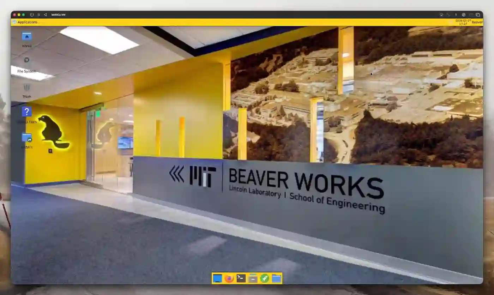

# bASICs VM

A prebuilt Linux desktop that packages EDA tools, the SKY130 PDK, examples, templates, and documentation into VM images for x86 and AArch64 machines across macOS, Windows, and Linux.

Docs: [basics.alpacawebservices.com](https://basics.alpacawebservices.com).

This monorepo builds the VM from source. `flake.nix` is the main Nix entrypoint. The `nix/` directory defines the packaged tools, PDKs, templates, and docs. The `nixos/` directory defines the actual VM system (i.e. desktop setup, user account, filesystem layout, services, shortcuts, and environment variables.)

Files under `content/` are what get placed into the VM for users. That includes the example projects, project templates, and the VitePress docs source in `content/docs-site`. The VM exposes those pieces through `/home/beaver/bASICs`, with writable work kept separate from packaged reference material.

The `assets/` directory holds the visual pieces used by the VM, including logos, wallpaper, and desktop-facing images. The docs site also has its own public assets under `content/docs-site/public`, including screenshots and demo videos.
