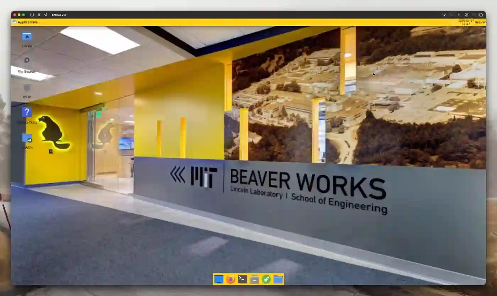

# bASICs VM

A prebuilt Linux desktop for EDA with ASICs. Builds for x86 and AArch64 machines across macOS, Windows, and Linux.

Docs: [basics.alpacawebservices.com](https://basics.alpacawebservices.com).

## TL;DR

This monorepo builds the VM from source. `flake.nix` is the main Nix entrypoint. `nix/` defines the packaged tools, PDKs, templates, and docs. `nixos/` defines the actual VM system (i.e. desktop setup, user account, filesystem layout, services, shortcuts, and environment variables.)

`content/` is placed into the VM for users; includes example projects & project templates. exposed through `/home/beaver/bASICs`. work and templates are kept separate via permissions

`assets/` holds the visual pieces (e.e logos, wallpaper)

Maintainers should start with [MAINTAINER_GUIDE.md](MAINTAINER_GUIDE.md).

## License

This repository is licensed under the MIT License. See [LICENSE](LICENSE).

Some bundled examples, assets, generated artifacts, fetched templates, PDK data,
and VM system packages remain under their own upstream licenses. See
[THIRD_PARTY_NOTICES.md](THIRD_PARTY_NOTICES.md) for citations and redistribution
notes.
