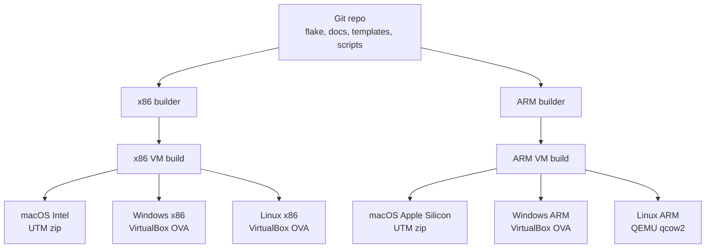

# Build from Source

The entire repository is a Nix flake. The flake pins the build inputs so the VM, local shell, PDKs, templates, and docs can be built from the same Git revision.

## Philosophy

Everything should be managed from one repo.

Docs, scripts, templates, package lists, PDK setup, and release config should stay in sync through Git. We should not need to hop between separate repos or hand-maintained setup notes to understand what is in a VM release.

Nix is used so the repo tracks the build inputs directly. The same revision should define the VM image, local shell, PDK install, templates, and release packages.



## Prerequisites

| Requirement | What to use |
| --- | --- |
| Builder OS | NixOS or another Linux host for x86; an ARM Linux builder for ARM |
| Free storage | At least 500 GB free on each builder, plus room for Nix caches |
| CPU and memory | At least 12 CPU cores and 32 GB RAM for fast builds; the ARM builder can run smaller with swap |
| Build time | About 6 to 10 minutes per release build |
| Build machines | One of each architecture |

## Get the source

```bash
git clone https://github.com/ZimengXiong/basicsvm.git
cd basicsvm
```

## Build a local VM

For a local x86 VM build:

```bash
scripts/build-vm x86_64
```

On an ARM builder:

```bash
scripts/build-vm aarch64
```

The result links show up under `out`:

```text
out/result-vm-x86_64
out/result-vm-aarch64
```

## Package release images

Package the target you want to publish:

```bash
scripts/package-vm macos-apple-silicon
scripts/package-vm macos-intel
scripts/package-vm windows-x86
scripts/package-vm windows-arm
scripts/package-vm linux-x86
scripts/package-vm linux-arm
```

Linux ARM ships as a QEMU disk image instead of a VirtualBox appliance.

| Target | Architecture | Output | Student host |
| --- | --- | --- | --- |
| `macos-apple-silicon` | `aarch64-linux` | zipped UTM bundle | Apple Silicon Mac |
| `macos-intel` | `x86_64-linux` | zipped UTM bundle | Intel Mac |
| `windows-x86` | `x86_64-linux` | VirtualBox OVA | Windows on Intel or AMD |
| `windows-arm` | `aarch64-linux` | VirtualBox OVA | Windows on ARM |
| `linux-x86` | `x86_64-linux` | VirtualBox OVA | Linux on Intel or AMD |
| `linux-arm` | `aarch64-linux` | QEMU QCOW2 | Linux on ARM |

To build the full release batch:

```bash
scripts/release-all
```

## ARM builder

ARM release targets need an ARM Linux builder. That can be a real ARM Linux machine or a Linux VM running on an ARM host.

Point the release script at that builder with environment variables:

```bash
BASICS_ARM_BUILDER=user@arm-builder BASICS_ARM_LIMA=lima-vm-name scripts/build-release arm
```

`BASICS_ARM_BUILDER` is the SSH target for the ARM host. If that host uses Lima, set `BASICS_ARM_LIMA` to the Lima VM name. If your ARM builder is already a Linux machine, leave the Lima variable out.

The script copies finished ARM artifacts back into local `out/release`. Some ARM hosts cannot run every packaging tool directly, so the scripts do the final wrapping locally when needed.

## Verify the build

Before publishing, run the checks:

```bash
scripts/nix flake check
scripts/verify-source
scripts/verify-fresh
```

`verify-fresh` rebuilds the profile, templates, and PDK packages, then checks the tool installs, Python imports, PDK links, and templates.

After that, boot at least one x86 release and one ARM release. In each VM, run the SKY130 counter flow from [First Flow](../use/first-flow.md).
