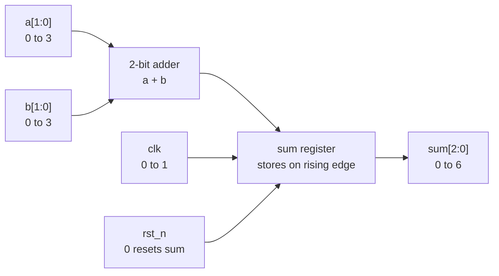

# Adder From Scratch

Build a 2-bit registered adder by writing Verilog, simulating it, synthesizing it, choosing a PDK, and running OpenLane to produce a GDS layout.

The circuit has two 2-bit inputs, `a` and `b`. Each input can hold a number from 0 to 3. The circuit adds them together and stores the answer in `sum` on each rising edge of `clk`.

The output is 3 bits wide because the largest result is `3 + 3 = 6`, and 6 needs 3 bits in binary.



Terms in this circuit:

- `a[1:0]` and `b[1:0]` are 2-bit buses. The bits are numbered 1 down to 0.
- `sum[2:0]` is a 3-bit bus. The extra bit holds the carry from the addition.
- `clk` is the clock. A clock is a signal that repeatedly changes between 0 and 1.
- A **rising edge** is the moment when `clk` changes from 0 to 1.
- A **register** stores a value. Here, `sum` stores the adder result on the rising edge of `clk`.
- `rst_n` is an active-low reset. The `_n` suffix means the reset is active when the signal is 0.
- When reset is active, `sum` is forced to 0 instead of storing `a + b`.

You will use these terms throughout the guide:

- **Verilog** is the text language we will use to describe the circuit.
- **RTL** means register-transfer level. It describes hardware behavior around registers and clock cycles.
- **Simulation** runs the Verilog so we can check the circuit's behavior.
- **Synthesis** turns RTL into a netlist made from standard cells such as gates and flip-flops.
- **A PDK** is the process design kit. It provides design rules, timing data, and cell libraries for a manufacturing process.
- **OpenLane** places the cells, routes wires, checks the result, and writes the layout files.

## Create the project

Start in `~/bASICs/work`, the writable workspace in the VM. Put the Verilog source in `src`; the tools will write outputs under `runs`.

```bash
# Move into the writable workspace.
cd ~/bASICs/work

# Create the project folder and the src folder for Verilog files.
mkdir -p adder2/src

# Move into the project folder.
cd adder2
```

## Write the RTL

The RTL is the hardware design. This one has two 2-bit inputs, a 3-bit output, a reset, and a clocked register named `sum`.

Create `src/adder2.v` in your editor.

The design will be a module named `adder2`. It has a clock, an active-low reset, two 2-bit inputs named `a` and `b`, and a 3-bit registered output named `sum`.

Type the RTL below into your file and read the comments as you go.

::: details Show one working RTL solution

```verilog
module adder2 (
    input wire clk,        // Clock: the output updates on its rising edge.
    input wire rst_n,      // Active-low reset: reset is active when this is 0.
    input wire [1:0] a,    // First 2-bit input. It can hold values 0 through 3.
    input wire [1:0] b,    // Second 2-bit input. It can hold values 0 through 3.
    output reg [2:0] sum   // 3-bit output. 3 + 3 = 6, which needs 3 bits.
);
    // This block describes flip-flops. It runs on the clock edge and also
    // responds immediately when reset falls.
    always @(posedge clk or negedge rst_n) begin
        if (!rst_n) begin
            sum <= 3'b000; // Put the registered output in a known reset state.
        end else begin
            sum <= a + b;  // Store the addition result on the next clock edge.
        end
    end
endmodule
```

:::

## Write a testbench

A testbench is Verilog used only for simulation. It drives inputs into your design, waits for clock edges, and checks the outputs.

Create `src/adder2_tb.v`.

This testbench resets the design, tries two input pairs, stops if an output is wrong, and writes a waveform named `adder2.vcd`.

::: details Show one working testbench

```verilog
`timescale 1ns / 1ps // Simulation time unit is 1 ns; precision is 1 ps.

module adder2_tb;
    // These are driven by the testbench.
    reg clk = 0;
    reg rst_n = 0;
    reg [1:0] a = 0;
    reg [1:0] b = 0;

    // This observes the design output.
    wire [2:0] sum;

    // Instantiate the design under test and connect each port by name.
    adder2 dut (
        .clk(clk),
        .rst_n(rst_n),
        .a(a),
        .b(b),
        .sum(sum)
    );

    // Toggle the clock every 5 ns, making a 10 ns clock period.
    always #5 clk = ~clk;

    initial begin
        // Write a waveform file that GTKWave can open.
        $dumpfile("adder2.vcd");
        $dumpvars(0, adder2_tb);

        // Release reset after a little more than one clock edge.
        #12 rst_n = 1;

        // Drive 1 + 2, wait one clock, then check the registered result.
        a = 2'd1; b = 2'd2; #10;
        if (sum !== 3'd3) $fatal(1, "1 + 2 failed");

        // Drive the largest 2-bit addition, then check that 3 bits are enough.
        a = 2'd3; b = 2'd3; #10;
        if (sum !== 3'd6) $fatal(1, "3 + 3 failed");

        // End a passing simulation.
        $finish;
    end
endmodule
```

:::

## Simulate

Simulation checks the RTL behavior before you run the slower physical-design flow.

Run a lint check first:

```bash
# Check the Verilog without building or running a simulator.
verilator --lint-only src/adder2.v
```

Compile and run the testbench:

```bash
# Compile the RTL and testbench into a simulation program.
iverilog -g2012 -o adder2_tb src/adder2.v src/adder2_tb.v

# Run the compiled simulation.
vvp adder2_tb
```

The simulation writes `adder2.vcd`. Open it when you want to inspect the clock, reset, inputs, and registered output:

```bash
# Open the waveform file written by the testbench.
gtkwave adder2.vcd
```

## Synthesize RTL

Synthesis turns the RTL into connected hardware cells. Yosys reads the Verilog, chooses gates and flip-flops, and writes a synthesized Verilog netlist.

Ask Yosys to read your Verilog, synthesize the `adder2` top module, and write the synthesized netlist:

```bash
# Create the output folder if it does not already exist.
mkdir -p runs

# Read the RTL, synthesize the adder2 top module, and write a synthesized netlist.
yosys -p "read_verilog src/adder2.v; synth -top adder2; write_verilog runs/adder2.synth.v"
```

The synthesized Verilog is written to `runs/adder2.synth.v`.

## Pick the PDK

A chip layout depends on the manufacturing process. The PDK contains the metal layers, spacing rules, standard cells, timing data, and tool setup. This VM includes SKY130A.

Use the SKY130A PDK that is already installed in the VM:

```bash
# Print the PDK install location.
echo "$PDK_ROOT"

# Check that the SKY130A PDK directory exists.
test -d "$PDK_ROOT/sky130A"
```

## Add Timing Constraints

OpenLane needs a clock period for timing checks. A 10 ns clock period means a 100 MHz clock.

Create `src/impl.sdc`:

```tcl
# Define a 10 ns clock named clk on the top-level clk port.
create_clock [get_ports clk] -name clk -period 10
```

Create `src/signoff.sdc` with the same line:

```tcl
# Define the same 10 ns clock for final timing checks.
create_clock [get_ports clk] -name clk -period 10
```

`impl.sdc` is used during place and route. `signoff.sdc` is used during final timing checks.

## Add Pin Order

The layout needs physical pins around the edge of the block. This file puts the clock and reset on one side and the data signals on another.

Create `pin_order.cfg`:

```text
#N
clk
rst_n

#S
a.*
b.*
sum.*
```

`#N` is the north-side pin directive. `#S` is the south-side pin directive. The `.*` patterns match every bit in each bus, such as `a[0]` and `a[1]`.

## Write OpenLane Config

The OpenLane config names the top module, points at the RTL and constraint files, chooses the clock, sets simple floorplan options, and selects the SKY130 standard-cell library.

Create `config.yaml`:

```yaml
# Top module name. This must match the Verilog module.
DESIGN_NAME: adder2

# RTL source file. dir:: means the path is relative to this config file.
VERILOG_FILES: dir::src/adder2.v

# Clock port and period in ns.
CLOCK_PORT: clk
CLOCK_PERIOD: 10

# Timing constraints and pin placement files.
PNR_SDC_FILE: dir::src/impl.sdc
SIGNOFF_SDC_FILE: dir::src/signoff.sdc
FP_PIN_ORDER_CFG: dir::pin_order.cfg

# Keep placement loose for this very small design.
FP_CORE_UTIL: 30
PL_TARGET_DENSITY_PCT: 55

# Simple power grid settings for the tiny block.
FP_PDN_VOFFSET: 5
FP_PDN_HOFFSET: 5
FP_PDN_VWIDTH: 2
FP_PDN_HWIDTH: 2
FP_PDN_VPITCH: 30
FP_PDN_HPITCH: 30
FP_PDN_SKIPTRIM: true

# Use the SKY130 high-density standard-cell library when the selected PDK is SKY130.
pdk::sky130*:
  STD_CELL_LIBRARY: sky130_fd_sc_hd
```

## Run OpenLane

Now run the physical implementation flow. OpenLane will synthesize the design, create a floorplan, place cells, route wires, run checks, and write final outputs.

```bash
# Run the RTL-to-GDS flow with the installed SKY130A PDK.
openlane --manual-pdk --pdk sky130A --pdk-root "$PDK_ROOT" config.yaml
```

The run can take several minutes. Near the end, a passing run prints `Flow complete`.

## Check the Output

GDS is the final layout format. It contains geometry on manufacturing layers, not Verilog behavior.

Go to the OpenLane runs folder and list the run directories:

```bash
# Enter the folder where OpenLane writes each run.
cd runs

# List the timestamped run directories.
ls
```

Change into the run directory that OpenLane just created. Type `cd `, then the directory name you see from `ls`.

```bash
# Replace RUN... with the timestamped directory you saw above.
cd RUN...
```

Look at the final layout outputs and check that the GDS exists:

```bash
# List the top level of the final output directory.
tree final -L 1

# Check that the GDS file exists and is not empty.
test -s final/gds/adder2.gds
```

Open the final GDS:

```bash
# Open the final layout in KLayout.
klayout final/klayout_gds/adder2.klayout.gds
```
